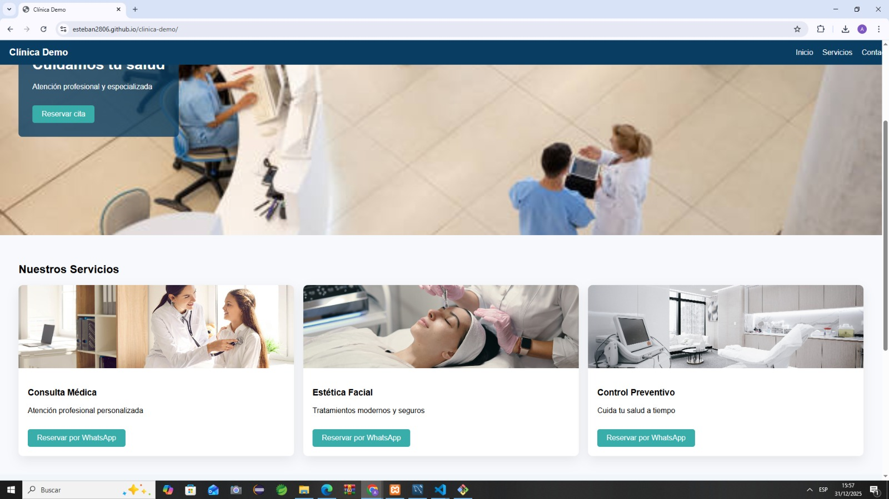

# 🏥 Demostración Clínica – Página Web Informativa

Proyecto demostrativo de una página web para clínicas y consultorios médicos, desarrollada con HTML, CSS y JavaScript.

## 📌 Descripción
Sitio web moderno y responsive que permite a una clínica mostrar sus servicios médicos, horarios de atención y contacto directo por WhatsApp.

## 👨‍⚕️ Ideal para
- Clínicas
- Consultorios médicos
- Médicos independientes
- Centros de salud

## ⚙️ Funcionalidades
- Información clara de servicios
- Diseño adaptable a celular y PC
- Botón de contacto por WhatsApp
- Carga rápida

## 🛠️ Tecnologías
- HTML5
- CSS3
- JavaScript

## 🌐 Demo en vivo
https://esteban2806.github.io/clinica-demo/

📞 Contacto
Si necesitas una página web para tu negocio:

📱WhatsApp: 906 202 457
📧Correo: tapiaingaharold@gmail.com
